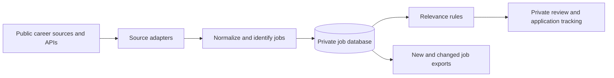

# Operation1million: Job Discovery

A project exploring how to discover relevant hardware engineering opportunities
with less repeated searching and a clear separation between public design and
private operating data.

This repository shares the idea and architecture. The implementation, configured
sources, credentials, collected records, and personal application information
are maintained privately.

## The idea

1. Discover opportunities through supported public career sources and APIs.
2. Normalize different provider responses into a common job record.
3. Track stable identities to distinguish newly observed jobs from updates.
4. Apply configurable relevance rules without downloading the same data again.
5. Present relevant opportunities for review and later application tracking.

## Proposed flow

## Design principles

- Prefer structured public list endpoints when available.
- Respect source limits and verification challenges; stop and preserve cooldowns.
- Make paid search an explicit, budgeted operation.
- Validate employer identity instead of treating search text as a strict filter.
- Keep discovery, relevance decisions, and application status separate.
- Store first-observed time separately from the provider's posting date.
- Record partial failures without claiming complete coverage or closing unseen
  jobs after an incomplete run.

Daily processing should export only newly observed or changed records. Some
sources still require scanning their current lists to discover those changes;
deduplication alone does not guarantee fewer network requests.

## Data model direction

One private job database can hold companies, sources, discovery queries, jobs,
source identities, runs, and synchronization progress in separate tables.
Relevance decisions and application status can be added without replacing the
original source records. Cooldown and request-budget state must also survive
between runs.

## Privacy boundary

| Public | Private |
| --- | --- |
| Concept and architecture | Implementation and operating configuration |
| General design tradeoffs | API credentials and account settings |
| High-level roadmap | Downloaded records, databases, logs, and exports |
| | Personal information, filters, and application history |

Future scheduled discovery is intended to run in a private environment with
private durable state. This public repository does not run collection workflows
or distribute collected datasets.

## Status and next steps

Source adapters and conservative request pacing exist in the private
implementation. Persistent incremental job storage, recovery across hosted
runs, and a daily hosted schedule are planned work. The design above describes
the intended system, not a claim that every stage is deployed.
